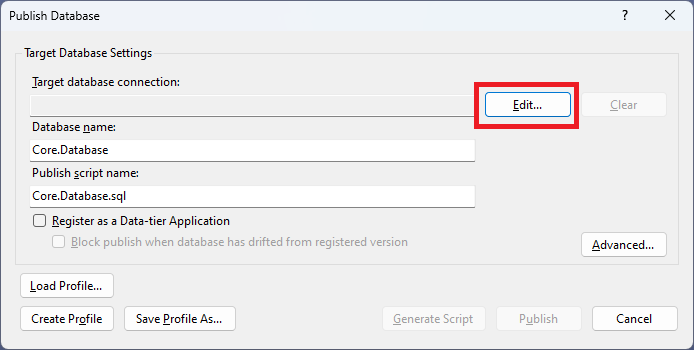
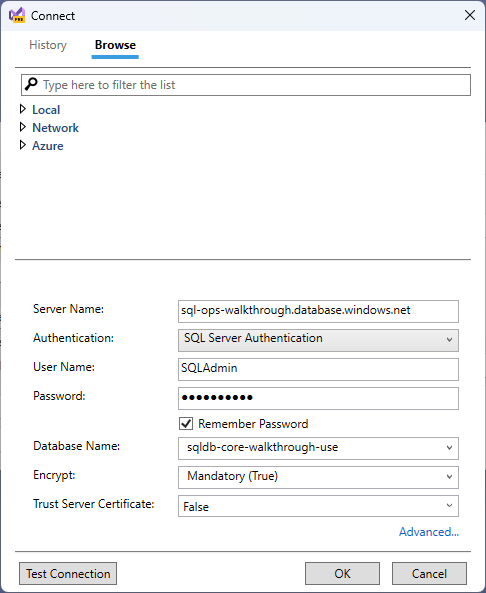
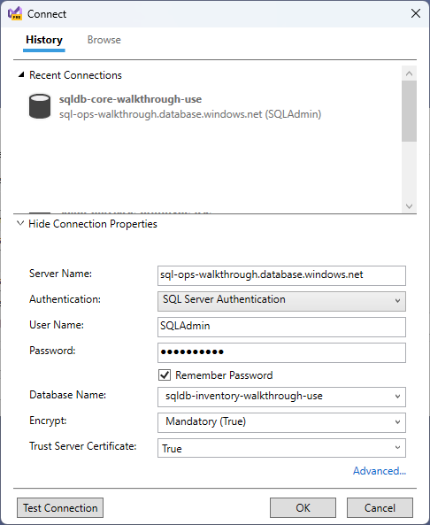

#02 - Initialize Databases

## User Story
As the architect, I want to initialize the databases so that I can use them in the workshop.

### Definition of Done
- [ ] The Core database has been created and the schema and data have been initialized
- [ ] The Inventory database has been created and the schema and data have been initialized
- [ ] The Notice database has been created and the schema and data have been initialized
- [ ]	The Purchase database has been created and the schema and data have been initialized
- [ ] The Shipping database has been created and the schema and data have been initialized
-	[ ] The database secrets have been added to Key Vault
-	[ ] The App Config settings have been updated to use the Key Vault secrets

---

## Workshop Exercises

**Tasks**
- 02A - [Create the Core Database](#create-the-core-database-02a)
- 02B - [Create the Inventory Database](#create-the-inventory-database-02b)
- 02C - [Create the Notice Database](#create-the-notice-database-02c)
- 02D - [Create the Purchase Database](#create-the-purchase-database-02d)
- 02E - [Create the Shipping Database](#create-the-shipping-database-02e)
- 02F - [Initialize the Core Database Schema and Data](#create-the-core-database-schema-02f)
- 02G - [Initialize the Inventory Database Schema and Data](#create-the-inventory-database-schema-02f)
- 02H - [Initialize the Notice Database Schema and Data](#create-the-notice-database-schema-02h)
- 02I - [Initialize the Purchase Database Schema and Data](#create-the-purchase-database-schema-02i)
- 02J - [Add database secrets to Key Vault](#add-database-secrets-to-key-vault-02j)
- 02K - [Add Key Vault reference to the App Config settings](#add-key-vault-reference-to-app-config-settings-02k)
- 02L - [Add Azure SQL settings to App Config settings](#add-azure-sql-settings-to-app-config-settings-02L)

### Create the Core Database (02A)
1. Navigate to the [Azure Portal](https://portal.azure.com)
1. Click the **Create a resource** button in the top left corner of the portal
1. Search for **SQL Database** and click the **Create** button
1. Fill out the form with the following values:
		- **Subscription**: Select the appropriate Azure subscription
		- **Resource Group**: Select the resource group you created in the previous section
		- **Database name**: Enter a name for your database
		- **Server**: Click **Create new** and enter a name for your server
    - **Authentication method**: Select **Use SQL authentication**
		- **Server admin login**: Enter a username for your server
		- **Password**: Enter a password for your server
		- **Location**: Select the location you used for your resource group
		- **Want to use SQL elastic pool?**: Select **No**
		- **Workload environment**: Select **Development**
1. Click the **Review + create** button
1. CLick the **Create** button
1. After the database has been created, click on the **Go to Resource** button
1. Under **Configure access**, click the **Configure** button
1. From the **Public access** tab, ensure that **Selected networks** is selected
1. CLick the **Add your client IPv4 address(xxx.xxx.xxx.xxx)** button
1. Ensure that **Allow Azure services and resources to access this server** is selected
1. Click the **Save** button

### Create the Inventory Database (02B)
1. Click the **Overview** button on the left side of the portal
1. Click the **Create database** button
1. Fill out the form with the following values:
		- **Database name**: Enter a name for your database
		- **Want to use SQL elastic pool?**: Select **No**
		- **Workload environment**: Select **Development**
1. Click the **Review + create** button
1. CLick the **Create** button
1. Click the **Go to resource** button
1. Click the **Server name** link

### Create the Notice Database (02C)
1. Click the **Create database** button
1. Fill out the form with the following values:
		- **Database name**: Enter a name for your database
		- **Want to use SQL elastic pool?**: Select **No**
		- **Workload environment**: Select **Development**
1. Click the **Review + create** button
1. CLick the **Create** button
1. Click the **Go to resource** button
1. Click the **Server name** link

### Create the Purchase Database (02D)
1. Click the **Create database** button
1. Fill out the form with the following values:
		- **Database name**: Enter a name for your database
		- **Want to use SQL elastic pool?**: Select **No**
		- **Workload environment**: Select **Development**
1. Click the **Review + create** button
1. CLick the **Create** button
1. Click the **Go to resource** button
1. Click the **Server name** link

### Create the Shipping Database (02E)
1. Click the **Create database** button
1. Fill out the form with the following values:
		- **Database name**: Enter a name for your database
		- **Want to use SQL elastic pool?**: Select **No**
		- **Workload environment**: Select **Development**
1. Click the **Review + create** button
1. CLick the **Create** button
1. Click the **Go to resource** button
1. Click the **Server name** link

### Initialize the Core Database Schema and Data (02F)
1. From the database listing, click on the *Core* database that you created
1. Hover over the **Server name** link and click the **Copy** button
1. From Visual Studio, right click on the *Core.Database* project and select **Publish**
1. The **Publish Database** window will appear, click the **Edit** button

1. Click the **Browse** tab
1. Paste the server name into the **Server name** field
1. Change	**Authentication** to **SQL Server Authentication**
1. Enter the appropriate **User Name** and **Password** for the server
1. Ensure that **Save Password** is checked
1. Select the **Core** database from the **Database name** dropdown
1. Set **Trust Server Certificate** to **True**
1. Click the **OK** button

1. CLick the **Publish** button

### Initialize the Inventory Database Schema and Data (02G)
1. From Visual Studio, right click on the *Inventory.Database* project and select **Publish**
1. The **Publish Database** window will appear, click the **Edit** button
1. From the **History** tab, click on the **Core** database you just used
1. Click **Show Connection Properties**
1. Select the **Inventory** database from the **Database name** dropdown
1. Set **Trust Server Certificate** to **True**
1. Click the **OK** button

1. CLick the **Publish** button

### Initialize the Notice Database Schema and Data (02H)
1. From Visual Studio, right click on the *Notice.Database* project and select **Publish**
1. The **Publish Database** window will appear, click the **Edit** button
1. From the **History** tab, click on the **Inventory** database you just used
1. Click **Show Connection Properties**
1. Select the **Notice** database from the **Database name** dropdown
1. Set **Trust Server Certificate** to **True**
1. Click the **OK** button
1. CLick the **Publish** button

### Initialize the Purchase Database Schema and Data (02I)
1. From Visual Studio, right click on the *Purchase.Database* project and select **Publish**
1. The **Publish Database** window will appear, click the **Edit** button
1. From the **History** tab, click on the **Notice** database you just used
1. Click **Show Connection Properties**
1. Select the **Purchase** database from the **Database name** dropdown
1. Set **Trust Server Certificate** to **True**
1. Click the **OK** button
1. CLick the **Publish** button

### Initialize the Shipping Database Schema and Data (02I)
1. From Visual Studio, right click on the *Shipping.Database* project and select **Publish**
1. The **Publish Database** window will appear, click the **Edit** button
1. From the **History** tab, click on the **Shipping** database you just used
1. Click **Show Connection Properties**
1. Select the **Purchase** database from the **Database name** dropdown
1. Set **Trust Server Certificate** to **True**
1. Click the **OK** button
1. CLick the **Publish** button

### Add database secrets to Key Vault (02J)
1. Navigate to the [Azure Portal](https://portal.azure.com)
1. Open the previously created Key Vault account
1. Click the **Secrets** option on the left-hand menu
1. CLick the **+ Generate/Import** button
1. Enter the following information:

| Field | Value |
|-------|-------|
| Name | AzureSQLUserId |
| Secret value | Identifier of the Azure SQL user you created in step 2A |

6. Click the **Create** button
1. CLick the **+ Generate/Import** button
1. Enter the following information:

| Field | Value |
|-------|-------|
| Name | AzureSqlPassword |
| Secret value | Password for the Azure SQL user you created in step 2A |

9. Click the **Create** button

### Add Key Vault reference to the App Config settings (02K)
1. Navigate to the GitHub repository you created for the workshop
1. Edit the **OrderProcessingSystem/config/secretreferences.json** file
1. Add the AzureSql:UserId and AzureSql:Password elements

~~~
  "AzureSql":{
    "UserId": "{\"uri\":\"https://{KEY_VAULT_ENDPOINT}/secrets/AzureSqlUserId\"}",
    "Password": "{\"uri\":\"https://{KEY_VAULT_ENDPOINT}/secrets/AzureSqlPassword\"}"
  }
~~~

4. Click the **Commit changes...** button

### Add Azure SQL settings to App Config settings (02L)
1. Edit the **OrderProcessingSystem/config/appsettings.json** file
1. Add the AzureSql:DataSource, Core:AzureSql:Catalog, Inventory:AzureSql:Catalog, Notice:AzureSql:Catalog, Purchase:AzureSql:Catalog, and Shipping:AzureSql:Catalog elements

~~~
"AzureSql": {
  "DataSource": "sql-ops-walkthrough.database.windows.net"
},
"Core": {
  "AzureSql": {
    "Catalog": "sqldb-core-walkthrough-use"
  }
},
"Inventory": {
  "AzureSql": {
    "Catalog": "sqldb-inventory-walkthrough-use"
  }
},
"Notice": {
  "AzureSql": {
    "Catalog": "sqldb-notice-walkthrough-use"
  }
},
"Purchase": {
  "AzureSql": {
    "Catalog": "sqldb-purchase-walkthrough-use"
  }
},
"Shipping": {
  "AzureSql": {
    "Catalog": "sqldb-shipping-walkthrough-use"
  }
}
~~~

3. Click the **Commit changes...** button
1. Click on the **Actions** tab and validate that the **AppConfig** workflow completed successfully twice

