#03 - Initialize Product Database
The product database is hosted on Cosmos DB. During this step of the workshop, we will initialize that database's data.

**Tasks**
- 03A - [Create the Products database](#create-the-products-database-03a)
- 03B - [Create the database containers](#create-the-database-containers-03b)
- 03C - [Create Cosmos DB Change Feed Triggers](#create-cosmos-db-change-feed-triggers-03c)
- 03D - 

At the completion of the tasks, you should commit the changes to your GitHub repository.

## Create the Products database (03A)
1. From the	[Azure Portal](https://portal.azure.com), click the Cosmos DB account you previously created

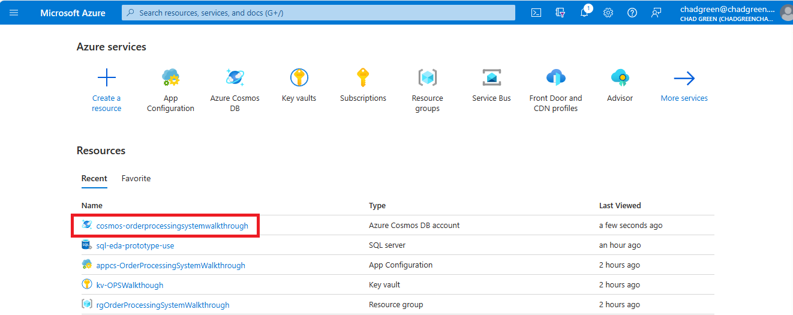

2. Click the **Data Explorer** link in the left-hand menu
1. From the **New Container** dropdown button, select **New Database**
1. Enter **products** as the **Database id** and click **OK**

## Create the database containers (03B)
**Merchandise Container**
1. Hover over the **products** database and click the **New Container** button
1. Enter **merchandise** as the **Container id**
1. Enter **/id** as the **Partition key**
1. Click the **OK** button

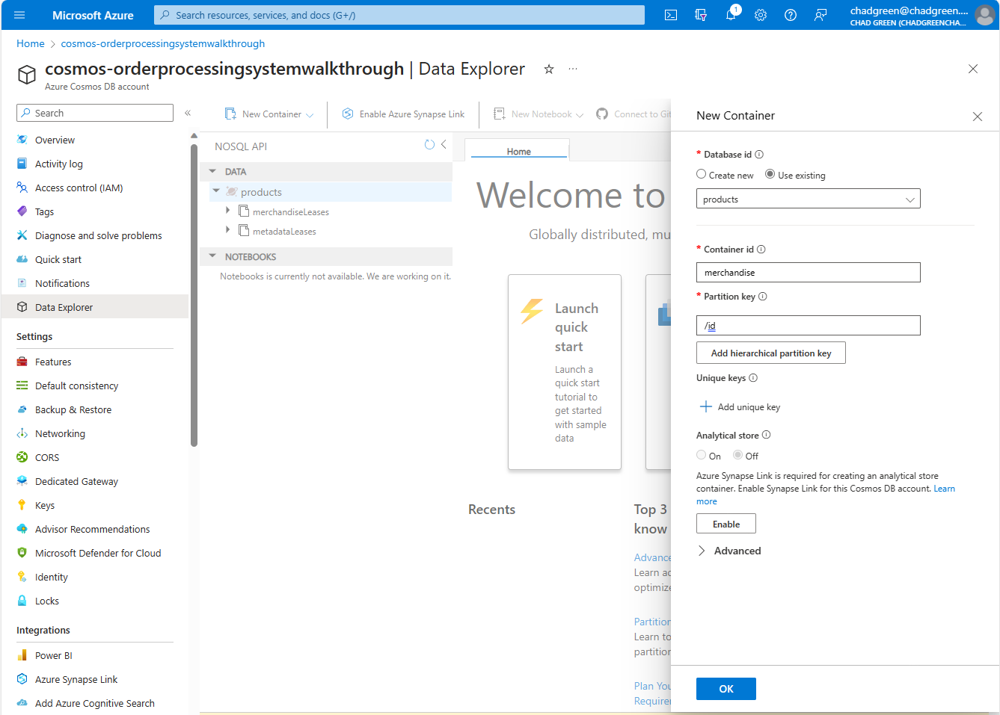

**Merchandise by Availability Container**
1. Hover over the **products** database and click the **New Container** button
1. Enter **merchandiseByAvailability** as the **Container id**
1. Enter **/availabilityId** as the **Partition key**
1. Click the **OK** button

**Merchandise by Theme Container**
1. Hover over the **products** database and click the **New Container** button
1. Enter **merchandiseByTheme** as the **Container id**
1. Enter **/themeId** as the **Partition key**
1. Click the **OK** button

**Metadata Container**
1. Hover over the **products** database and click the **New Container** button
1. Enter **metadata** as the **Container id**
1. Enter **/metadataType** as the **Partition key**
1. Click the **OK** button

After creating your containers, you Data Explorer should look like this:

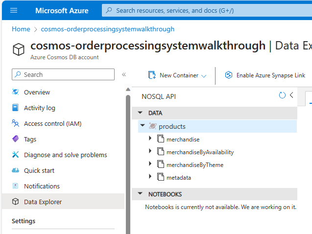

## Create Cosmos DB Change Feed Triggers (03C)
1. From Visual Studio, right click the Product solution folder and select **Add -> New Project**
1. Search for **Azure Functions**, select the **Azure Functions** template, and click the **Next** button

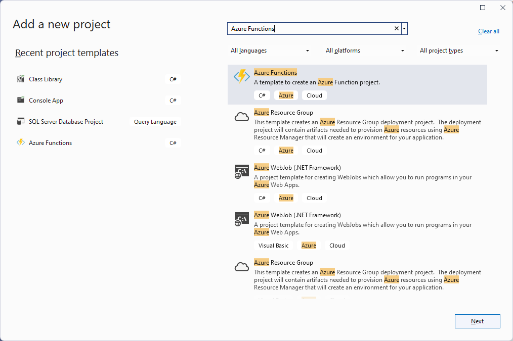

3. Name the project **Product.Functions**
1. Set the **Location** to the **Product** solution folder
1. Click the **Next** button

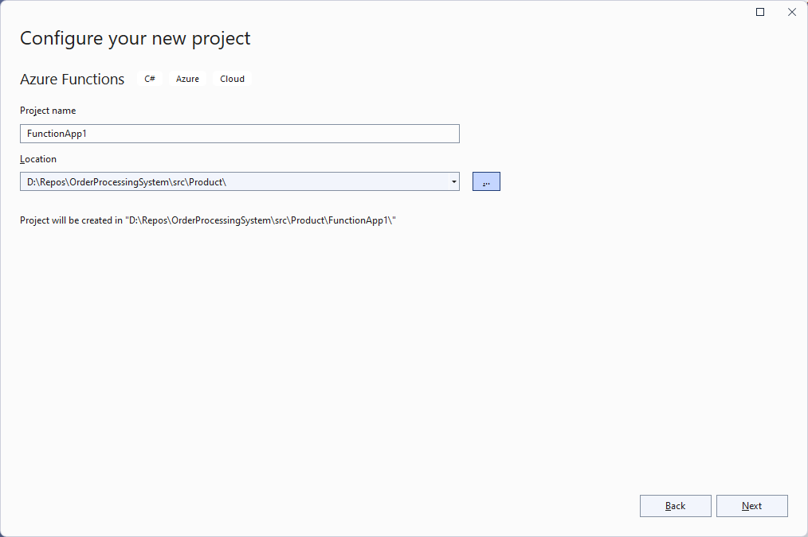

6. Select the *.NET 7.0 Isolated* **Functions worker**
7. Select the *Cosmos DB Trigger* **Function**
8. Click the **Create** button

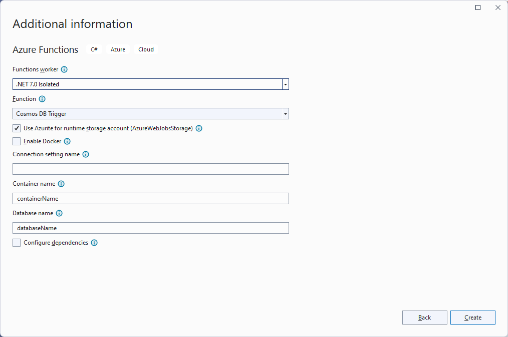

9. Delete the **Function1.cs** file from the **Product.Functions** project
10. Right click the **Product.Functions** project and select **Add Project Reference**
111. Select the **Product.Services** project and click the **OK** button

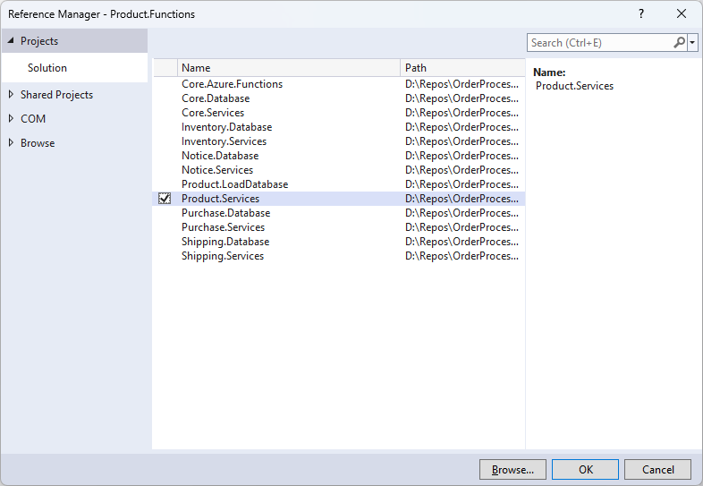

12. Open the **Program.cs** file in the **Product.Functions** project
13. Replace the existing code with the following code

```
using BuildingBricks.Core;
using BuildingBricks.Product.Services;
using Microsoft.Azure.Cosmos;
using Microsoft.Extensions.DependencyInjection;
using Microsoft.Extensions.Hosting;

string environment = Environment.GetEnvironmentVariable("AZURE_FUNCTIONS_ENVIRONMENT")!;
string appConfigEndpoint = Environment.GetEnvironmentVariable("AppConfigEndpoint")!;
ConfigServices configServices = new(appConfigEndpoint, environment);

using CosmosClient cosmosClient = new(configServices.CosmosUri, configServices.CosmosKey);
Database database = cosmosClient.GetDatabase(configServices.ProductCosmosDatabaseId);

MerchandiseServices merchandiseServices = new(database.GetContainer(configServices.ProductMerchandiseContainerId));
MerchandiseByAvailabilityServices merchandiseByAvailabilityServices = new(configServices, database.GetContainer(configServices.ProductsByAvailabilityContainerId));
MerchandiseByThemeServices merchandiseByThemeServices = new(configServices, database.GetContainer(configServices.ProductsByThemeContainerId));
AvailabilityServices availabilityServices = new(configServices, database.GetContainer(configServices.ProductMetadataContainerId));

IHost host = new HostBuilder()
	.ConfigureFunctionsWorkerDefaults()
	.ConfigureServices(s =>
	{
		s.AddSingleton((s) => { return configServices; });
		s.AddSingleton((s) => { return merchandiseServices; });
		s.AddSingleton((s) => { return merchandiseByAvailabilityServices; });
		s.AddSingleton((s) => { return merchandiseByThemeServices; });
		s.AddSingleton((s) => { return availabilityServices; });
	})
	.Build();

host.Run();
```

14. Right click the **Product.Functions** project and **Add > New Folder**
15. Name the new folder **Functions**
16. Right click the **Functions** folder and **Add > Class**
17. Name the new class **MetadataChangeMonitor.cs**
18. Replace the existing code with the following code

```
using BuildingBricks.Product.Models;
using BuildingBricks.Product.Services;
using Microsoft.Azure.Functions.Worker;
using Microsoft.Extensions.Logging;

namespace BuildingBricks.Product.Functions;

public class MetadataChangeMonitor
{

	private readonly ILogger _logger;
	private readonly MerchandiseServices _merchandiseServices;

	public MetadataChangeMonitor(
		ILoggerFactory loggerFactory,
		MerchandiseServices merchandiseServices)
	{
		_logger = loggerFactory.CreateLogger<MetadataChangeMonitor>();
		_merchandiseServices = merchandiseServices;
	}

	[Function("MetadataChangeMonitor")]
	public async Task RunAsync([CosmosDBTrigger(
		databaseName: "products",
		containerName: "metadata",
		Connection = "ConnectionString",
		LeaseContainerName = "metadataLeases",
		CreateLeaseContainerIfNotExists = true)] IReadOnlyList<IMetadata> changedMetadata)
	{
		if (changedMetadata != null && changedMetadata.Count > 0)
		{
			foreach (IMetadata changedMetadataItem in changedMetadata)
			{
				if (changedMetadataItem.MetadataType == Constants.MetadataType.Availability)
				{
					Availability changedAvailability = (Availability)changedMetadataItem;
					_logger.LogInformation("Updated Availability: {availabilityId} - {availabilityName}", changedAvailability.Id, changedAvailability.Name);
					List<Merchandise> merchandiseToUpdate = await _merchandiseServices.GetListByAvailabilityAsync(changedAvailability.Id);
					foreach (Merchandise merchandise in merchandiseToUpdate)
					{
						if (merchandise.Availability != changedAvailability.Name)
						{
							_logger.LogInformation("Updated Merchandise (Availability): {productId} - {productName}", merchandise.Id, merchandise.Name);
							merchandise.Availability = changedAvailability.Name;
							await _merchandiseServices.UpsertAsync(merchandise);
						}
					}
				}
				else if (changedMetadataItem.MetadataType == Constants.MetadataType.Theme)
				{
					Theme changedTheme = (Theme)changedMetadataItem;
					_logger.LogInformation("Updated Theme: {themeId} - {themeName}", changedTheme.Id, changedTheme.Name);
					foreach (ThemeMerchandise themeMerchandise in changedTheme.Merchandises)
					{
						Merchandise merchandise = await _merchandiseServices.GetAsync(themeMerchandise.ItemNumber);
						if (merchandise.ThemeName != changedTheme.Name)
						{
							merchandise.ThemeName = changedTheme.Name;
							await _merchandiseServices.UpsertAsync(merchandise);
							_logger.LogInformation("Updated Merchandise (Theme): {productId} - {productName}", merchandise.Id, merchandise.Name);
						}
					}
				}
				else
				{
					_logger.LogError("MetadataType {metadataType} is not supported.", changedMetadataItem.MetadataType);
				}
			}
		}
	}

}
```

19. Right click the **Product.Functions** project and **Add > New Folder**
20. Name the new folder **Functions**
21. Right click the **Functions** folder and **Add > Class**
22. Name the new class **MerchandiseChangeMonitor.cs**
23. Replace the existing code with the following code

```
using BuildingBricks.Product.Models;
using BuildingBricks.Product.Services;
using Microsoft.Azure.Functions.Worker;
using Microsoft.Extensions.Logging;

namespace BuildingBricks.Product.Functions;

public class MerchandiseChangeMonitor
{

	private readonly ILogger _logger;
	private readonly MerchandiseByAvailabilityServices _merchandiseByAvailabilityServices;
	private readonly MerchandiseByThemeServices _merchandiseByThemeServices;

	public MerchandiseChangeMonitor(
		ILoggerFactory loggerFactory,
		MerchandiseByAvailabilityServices merchandiseByAvailabilityServices,
		MerchandiseByThemeServices merchandiseByThemeServices)
	{
		_logger = loggerFactory.CreateLogger<MerchandiseChangeMonitor>();
		_merchandiseByAvailabilityServices = merchandiseByAvailabilityServices;
		_merchandiseByThemeServices = merchandiseByThemeServices;
	}

	[Function("MerchandiseChangeMonitor")]
	public async Task RunAsync([CosmosDBTrigger(
		databaseName: "products",
		containerName: "merchandise",
		Connection = "ConnectionString",
		LeaseContainerName = "merchandiseLeases",
		CreateLeaseContainerIfNotExists = true)] IReadOnlyList<Merchandise> changedMerchandises)
	{
		if (changedMerchandises != null && changedMerchandises.Count > 0)
		{
			foreach (Merchandise changedMerchandise in changedMerchandises)
			{
				if (changedMerchandise.TTL > 0)
				{
					_logger.LogInformation("Deleted Merchandise: {productId} - {productName}", changedMerchandise.Id, changedMerchandise.Name);
					await _merchandiseByAvailabilityServices.DeleteAsync(changedMerchandise);
					await _merchandiseByThemeServices.DeleteAsync(changedMerchandise);
				}
				else
				{
					_logger.LogInformation("Updated Merchandise: {productId} - {productName}", changedMerchandise.Id, changedMerchandise.Name);
					await _merchandiseByAvailabilityServices.UpsertAsync(changedMerchandise);
					await _merchandiseByThemeServices.UpsertAsync(changedMerchandise);
				}
			}
		}
	}

}
```

24. Open the local.settings.json file in the **Product.Functions** project
25. Add the following settings to the **Values** section

* AppConfigEndpoint - To the App Configuration endpoint you created in the previous step
* ConnectionString - To the Cosmos DB connection string you created in the previous step

```
{
	"IsEncrypted": false,
	"Values": {
		"FUNCTIONS_WORKER_RUNTIME": "dotnet-isolated",
		"AppConfigEndpoint": "<App Configuration Endpoint>",
		"ConnectionString": "<Cosmos DB Connection String>"
	}
}
```

## Run the load product database process (03C)
1. Open the **Program.cs** file in the **Product.LoadDatabase** project
1. On line 12, replace **appConfigEndpoint** with the App Configuration endpoint you created in the previous step
1. Right-click on the **OrderProcessingSystem** solution and select **Configure Startup Projects**
1. Select **Multiple startup projects**
1. Set the following projects to **Start**:
	* Product.Functions
	* Product.LoadDatabase
1. Click the OK button

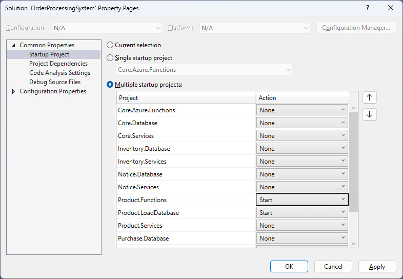

7. Press **F5** to run the solution
1. Wait for the **Product.Functions	** project console window to display "Worker process started and initialized."

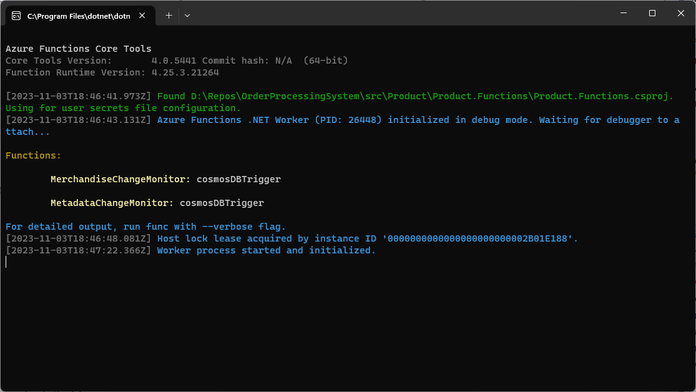

9. Enter the path to the data directory (for example, D:\Repos\OrderProcessingSystem\data\products)
1. Allow the process to run until it completes

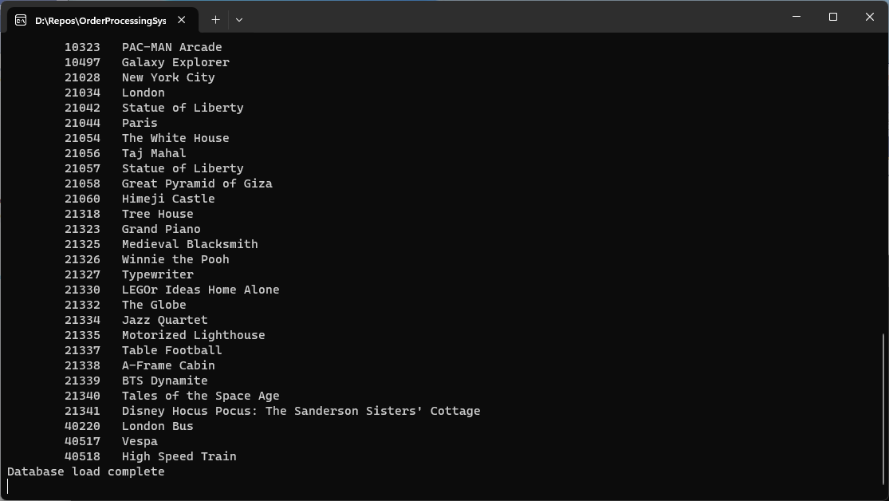
*Load.Database Console Window*

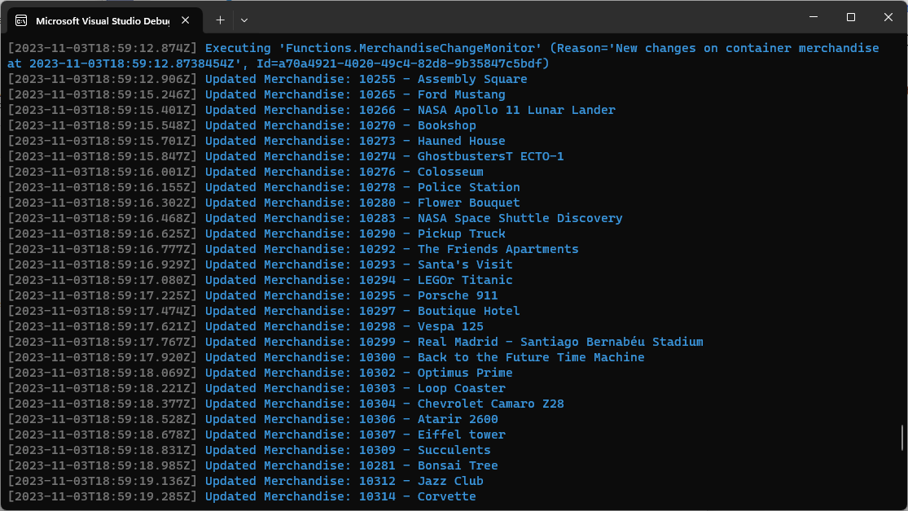
*Load.Functions Console Window*