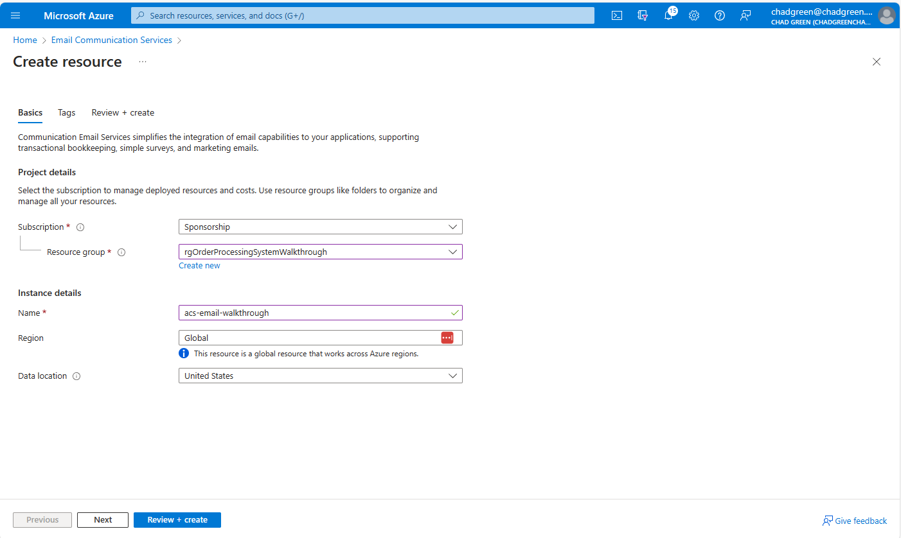
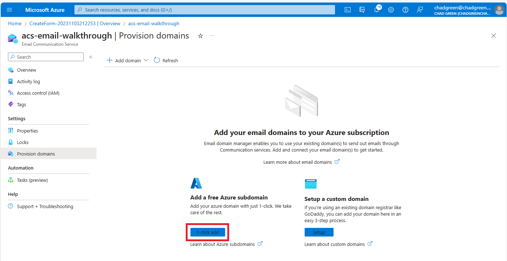
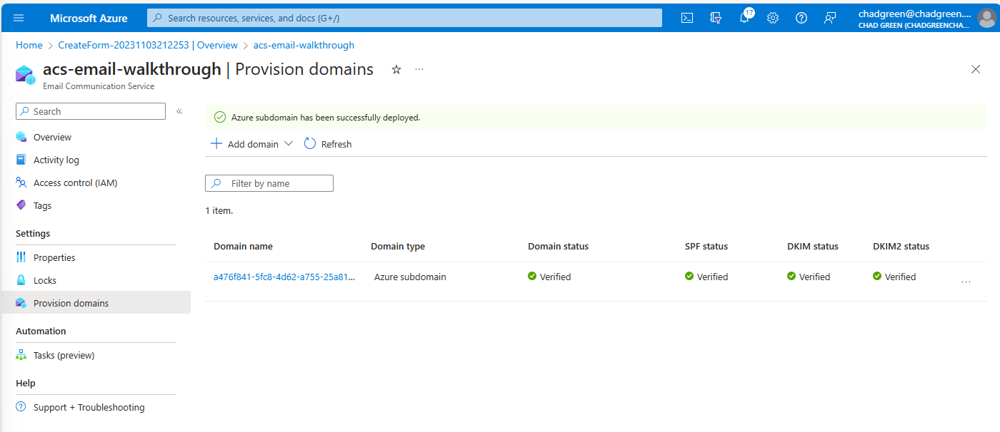
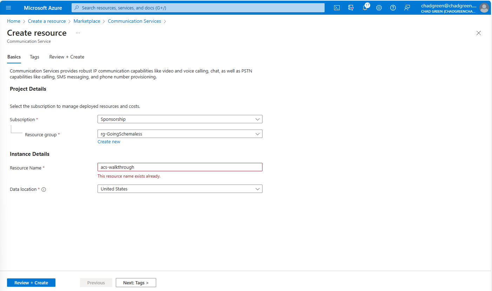
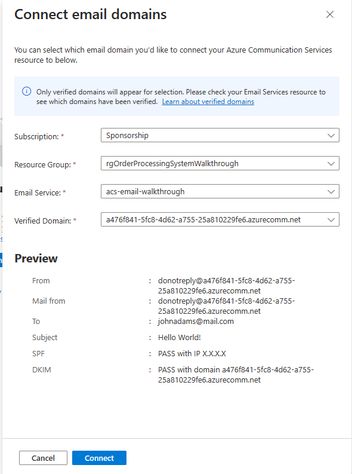
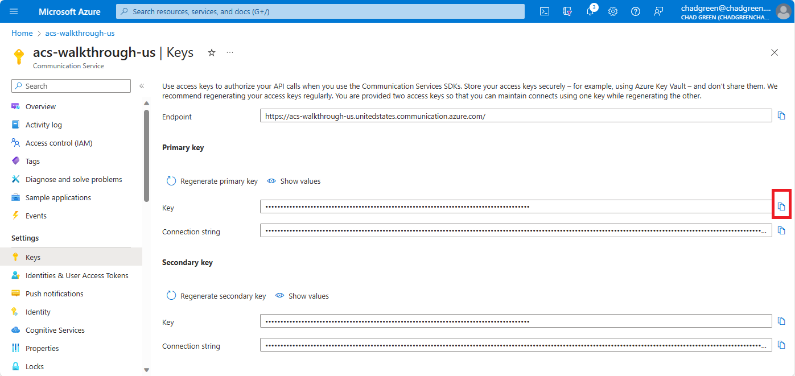
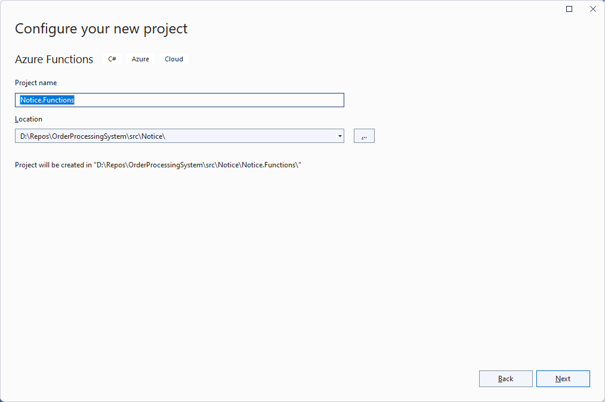
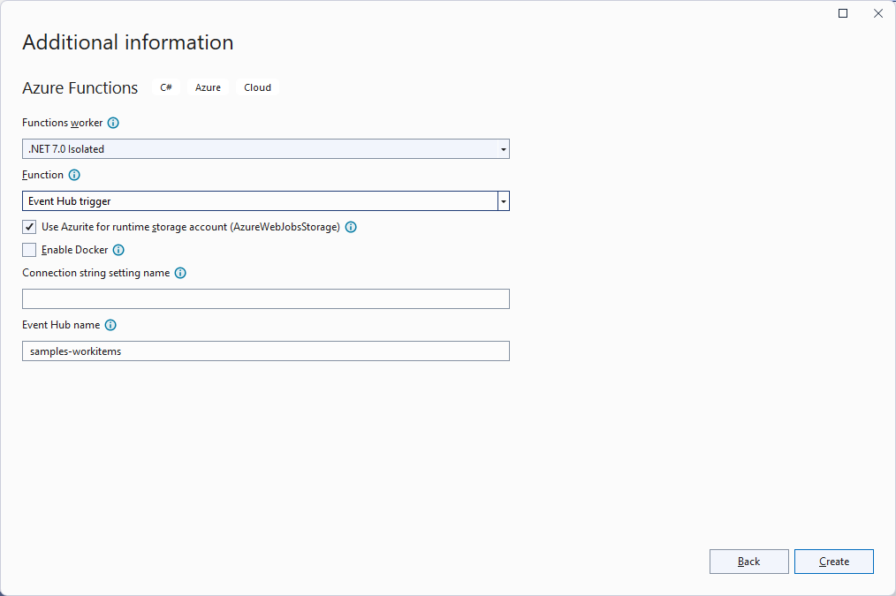
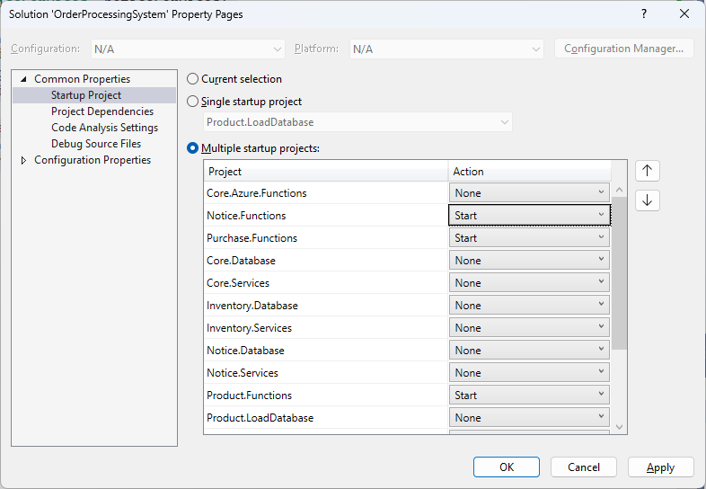

# 05 - Send Order Confirmation (Notice)

## User Story
After receiving a notification from the Purchase system that a purchase has been made, the Notice system will send the customer an email confirming the order. The email confirmation shall be logged for compliance reasons.

## Tasks
- 05A - [Create a consumer group for Notice on the Place Order event hub](#create-a-consumer-group-for-notice-on-the-place-order-event-hub-05a)
- 05B - [Add a shared access policy for Notice to access the Place Order event hub](#add-a-shared-access-policy-for-notice-to-access-the-place-order-event-hub-05a)
- 05C - [Create the Email Communication Service resource](#create-the-email-communication-service-resource-05b)
- 05D - [Provision email domain](#provision-email-domain-05c)
- 05E - [Create a Communication Service Resource](#create-a-communication-service-resource-05d)
- 05F - [Connect the email domain to the Communication Service resource](#connect-the-email-domain-to-the-communication-service-resource-05e)
- 05G - [Add Sender Email Address to the App Config](#add-sender-email-address-to-the-app-config-05f)
- 05H - [Add Communication Service Connection String to Key Vault](#add-communication-service-connection-string-to-key-vault-05g)
- 05I - [Add service logic for user story](#add-service-logic-for-user-story-05h)
- 05J - [Create an Azure Function to trigger the email confirmation to be sent](#create-an-azure-function-to-trigger-the-email-confirmation-to-be-sent-05i)
- 05K - [Test the Send Order Confirmation User Story](test-the-send-order-confirmation-user-story-05j)

### Create a consumer group for Notice on the Place Order event hub (05A)
1. From the [Azure Portal](https://portal.azure.com), navigate to the Event Hub namespace you created for the workshop.
1. From the **Event Hubs** listing, click on the **Order Placed** event hub.
1. Click on the **Consumer groups** option under **Entities** from the left-hand navigation pane.
1. Click on the **+ Consumer group** button.
1. Enter 'notice' in the **Name** field and click the **Create** button.
1. 

### Add a shared access policy for Notice to access the Place Order event hub (05B)
1. Navigate to the **OrderPlaced** Event Hub
1. Click on the **Shared access policies** option from the left-hand menu
1. Click the **Add** button
1. In the **Add SAS Policy** blade, enter the following:

| Field       | Value     |
|-------------|-----------|
| Policy name | Notice    |
| Manage      | Unchecked |
| Send        | Unchecked |
| Listen      | Checked   |

4. Click the **Create** button

**Copy the SAS Policy Connection String**
1. Click on the policy you just created
1. Copy the **Connection string-primary key**

### Create the Email Communication Service resource (05C)
1. Navigate to the [Azure portal](https://portal.azure.com) to create a new resource.
1. Search for Email Communications Service and hit enter. Select **Email Communication Services** and press **Create**.

3. Complete the required information on the basics tab:

- Select the Azure subscription you have been using for the workshop.
- Select the resource group you created for the workshop.
- Select **United States** as the data location.

4. Click the **Review + create** button

5. Wait for the validation to pass. Click **Create**.
1. Wait for the Deployment to complete. Click **Go to Resource** to navigate to the Communication Service Overview Page.

### Provision email domain (5D)
1. From the *Email Communication Service* page, click on the **Provision domains** option from the left-hand menu
1. Click on the **1-click add** button

After a minute or two, the email domain will be created.

### Create a Communication Service Resource (05E)
1. Navigate to the [Azure portal](https://portal.azure.com) to create a new resource.
1. Search for Communication Services and hit enter. Select **Communication Services** and press **Create**.
1. Complete the required information

- Select the Azure subscription you have been using for the workshop.
- Select the resource group you created for the workshop.
- End the name of the resource

4. Click the **Review + Create** button

5. Wait for the validation to pass. Click **Create**.
1. Wait for the Deployment to complete. Click **Go to resource** to navigate to the Communication Service page.

### Connect the email domain to the Communication Service resource (05F)
1. In the Azure Communication Service Resource overview page, click the **Domains** on the left navigation panel under Email
2. Click the **Connect domain** button
3. Select the email domain create above

4. Click the **Connect** button.
5. CLick the **Try Email** on the left navigation panel under Email
1. Enter the required information and click the **Send** button
1. Validate the email is received

### Add Sender Email Address to the App Config (05G)
1. From the **Try Email** screen, copy the *from* email address

2. Navigate to the GitHub repository you created for the workshop.
1. Open the **config/appsettings.json** file in edit mode.
1. Add the Notice:SenderAddress element.

~~~
"Notice": {
  "AzureSql": {
    "Catalog": "{NOTICE_CATALOG_NAME}"
  },
  "SenderAddress": "{SENDER_EMAIL_ADDRESS}"
}
~~~

5. Click the **Commit changes...** button.
1. Validate that the AppConfig workflow completed successfully.

### Add Communication Service Connection String to Key Vault (05H)
1. Click on the **Keys** option under **Settings** on the left-hand navigation panel.
1. Click the **Copy** button on the **Primary key - Connection string**.

3. Navigate to the Key Vault you created for the workshop.
1. Click the **+ Generate/Import** button.
1. Enter the following information:

| Field        | Value                                                                     |
|--------------|---------------------------------------------------------------------------|
| Name         | ACSConnectionString                                                       |
| Secret Value | The Azure Communication Services connection string you previously copied. |

6. Click the **Create** button.
1. Navigate to the GitHub repository you create for the project.
1. Open the config/SecretReferences.json file for edit
1. Add the AzureCommunicationServices:ConnectionString element

~~~
"AzureCommunicationServices": {
  "ConnectionString": "{\"uri\":\"https://{KEY_VAULT_ENDPOINT}/secrets/ACSConnectionString\"}"
}
~~~

10. Click the **Commit changes...** button.
1. Validate that the **AppConfig** workflow completed successfully.

### Add service logic for user story (05I)
1. Add the **Azure.Communication.Email** NuGet package to the **Notice.Services** project
1. Right click on the **Notice.Services** and select **Add > Class**
1. Name the new class **NoticeServices.cs**
1. Replace the existing code with the following:

~~~
namespace BuildingBricks.Notice;

public class NoticeServices : ServicesBase
{

	public NoticeServices(ConfigServices configServices) : base(configServices) { }

}
~~~

**Add generic logic to send emails**
Add the following private methods to the NoticeServices class:

~~~
using Azure;
using Azure.Communication.Email;
using BuildingBricks.Notice.Models;

private async Task SendEmailAsync(
	int customerId,
	int noticeTypeId,
	string subject,
	string htmlContent,
	string plainTextContent)
{
	using NoticeContext noticeContext = new(_configServices);
	Customer? customer = await noticeContext.Customers.FindAsync(customerId);
	if (customer is not null)
	{
		await noticeContext.NoticeLogs.AddAsync(new()
		{
			NoticeLogId = await SendEmailAsync(subject, htmlContent, plainTextContent, customer.EmailAddress),
			NoticeTypeId = noticeTypeId,
			CustomerId = customer.CustomerId,
			NoticeBody = htmlContent
		});
		await noticeContext.SaveChangesAsync();
	}
}

private async Task<string> SendEmailAsync(
	string subject,
	string htmlContent,
	string plainTextContent,
	string recipientAddress)
{
	EmailClient emailClient = new(_configServices.AzureCommunicationServicesConnectionString);
	EmailSendOperation emailSendOperation = await emailClient.SendAsync(
		WaitUntil.Completed,
		_configServices.NoticeSenderAddress,
		recipientAddress,
		subject,
		htmlContent,
		plainTextContent);
	return emailSendOperation.Id;
}
~~~

**Add logic to send the order confirmation email
Add the following SendOrderConfirmationAsync method to the PurchaseServices class:

~~~
public async Task SendOrderConfirmationAsync(OrderPlacedMessage orderPlacedMessage)
{
	string subject = $"Order Confirmation - {orderPlacedMessage.PurchaseId}";
	string htmlContent = $"<html><body>
Thank you for your order. Your order number is {orderPlacedMessage.PurchaseId}.
</body></html>";
	string plainTextContent = $"Thank you for your order. Your order number is {orderPlacedMessage.PurchaseId}.";
	await SendEmailAsync(orderPlacedMessage.CustomerId, NoticeTypes.OrderConfirmation, subject, htmlContent, plainTextContent);
}
~~~

### Create an Azure Function to trigger the email confirmation to be sent (5J)
1. For Visual Studio, right-click on the **Purchase** solution folder and select the **Add > New Project** option.
1. Select the **Azure Functions* project template
1. From the **Configure your new project** dialog, enter the following values:

| Field        | Value |
|--------------|-------|
| Project name | Notice.Functions |
| Location     | The Notice subfolder in your solution directory |

4. From the **Additional information** dialog, enter the following values:

| Field            | Value             |
|------------------|-------------------|
| Functions worker | .NET 7.0 Isolated |
| Function         | Event Hub trigger |

5. Click the **Create** button
1. Delete the generated **Function1.cs** file
1. Add project references to the Core.Azure.Functions and Notice.Services projects.
1. Open the **Program.cs** file in the **Notice.Functions** project and replace the code with the following:

~~~
using BuildingBricks.Core;
using BuildingBricks.Notice;
using Microsoft.Extensions.DependencyInjection;
using Microsoft.Extensions.Hosting;

string environment = Environment.GetEnvironmentVariable("AZURE_FUNCTIONS_ENVIRONMENT")!;
string appConfigEndpoint = Environment.GetEnvironmentVariable("AppConfigEndpoint")!;
ConfigServices configServices = new ConfigServices(appConfigEndpoint, environment);

NoticeServices noticeServices = new(configServices);

var host = new HostBuilder()
	.ConfigureFunctionsWorkerDefaults()
	.ConfigureServices(s =>
	{
		s.AddSingleton((s) => { return noticeServices; });
	})
	.Build();

host.Run();
~~~

9. Open the **local.settings.json** file in the **Notice.Functions** project and add the AppConfigEndpoint setting:

~~~
{
  "IsEncrypted": false,
  "Values": {
    "AzureWebJobsStorage": "UseDevelopmentStorage=true",
    "FUNCTIONS_WORKER_RUNTIME": "dotnet-isolated",
    "AppConfigEndpoint": "{APP_CONFIG_ENDPOINT}",
    "PlaceOrderConnectionString": "{EVENT_HUB_CONNECTION_STRING}",
    "PlaceOrderEventHub": "{EVENT_HUB_NAME}",
		"PlaceOrderConsumerGroup": "notice,
  }
}
~~~

10. Right-click on the **Notice.Functions** project and select **Add > New Folder**; name the folder **Functions**
1. Right-click on the **Functions** folder and select **Add > Class**
1. Name the new class **PlaceOrderMonitor.cs**
1. Replace the auto-generated code with the following:

~~~
using Azure.Messaging.EventHubs;
using BuildingBricks.EventMessages;
using Microsoft.Azure.Functions.Worker;
using Microsoft.Extensions.Logging;
using System.Text.Json;

namespace BuildingBricks.Notice.Functions;

public class PlaceOrderMonitor
{

	private readonly ILogger _logger;
	private readonly NoticeServices _noticeServices;

	public PlaceOrderMonitor(
		ILoggerFactory loggerFactory,
		NoticeServices noticeServices)
	{
		_logger = loggerFactory.CreateLogger<PlaceOrderMonitor>();
		_noticeServices = noticeServices;
	}

	[Function("Notice-PlaceOrderMonitor")]
	public async Task RunAsync([EventHubTrigger("%PlaceOrderEventHub%", Connection = "PlaceOrderConnectionString", ConsumerGroup = "%PlaceOrderConsumerGroup%")] EventData[] eventMessages)
	{
		foreach (EventData eventMessage in eventMessages)
		{
			OrderPlacedMessage? orderPlacedMessage = JsonSerializer.Deserialize<OrderPlacedMessage>(eventMessage.EventBody);
			if (orderPlacedMessage is not null)
			{
				_logger.LogInformation("Sending Confirmation Email for Purchase {PurchaseId}", orderPlacedMessage.PurchaseId);
				await _noticeServices.SendOrderConfirmationAsync(orderPlacedMessage);
			}
		}
	}

}
~~~

15. Right-click the **OrderProcessingSystem** solution and select **Configure Startup Projects**
1. Add Notice.Functions to the list of projects to be started

### Test the Send Order Confirmation User Story (5K)
1. Open Postman and create a new request
1. Change the HTTP verb to **Post**
1. Paste the **PlaceOrder** endpoint URL
1. Click the **Body** tab
1. Select **raw** and **JSON**
1. Enter the JSON below:

~~~
{
  "customerId": 1,
  "items":
  [
    {
      "productId": "10255",
      "quantity": 1
    }
  ]
}
~~~

7. Click the **Send** button
8. Validate that the confirmation email is sent