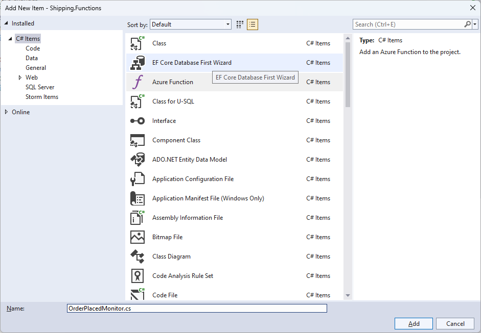

# 06 - Initialize Shipment (Shipping)

## User Story
When an order is placed, the Shipping services initializes the shipping record so the shipping department can forecast upcoming work.

### Definition of Done
- A new shipment record is created in the Shipping database

---

## Workshop Exercises

**Tasks**
- 06A - [Add consumer group for Shipping on the Order Placed event hub](add-consumer-group-for-shipping-on-the-order-placed-event-hub-06a)
- 06B - [Add a shared access policy for Shipping to access the Order Placed event hub](#add-a-shared-access-policy-for-shipping-to-access-the-order-placed-event-hub-06b)
- 06C - [Add service logic for user story](#add-service-logic-for-user-story-06c)
- 06D - [Create an Azure Function to watch for orders being placed](create-an-azure-function-to-watch-for-orders-being-placed-06d)
- 06E - [Test the Initialize Shipment User Story](test-the-initialize-shipment-user-story-06e)

### Add consumer group for Shipping on the Order Placed event hub (06A)
1. From the [Azure Portal](https://azure.portal.com), navigate to the Event Hub namespace created from the workshop.
1. Click on the **Order Placed** event hub from the **Event Hubs** listing.
1. Click on the **Consumer groups** option under **Entities** on the left-hand navigation panel
1. Click the **+ Consumer group** button.
1. Enter *shipping* in the **Name** field.
1. Click the **Create** button.

### Add a shared access policy for Shipping to access the Order Placed event hub (06B)
1. Click on the **Shared access policies** option under **Settings** on the left-hand navigation panel.
1. Click the **+ Add** button
1. In the **Add SAS Policy** blade, provide the enter the following:

- **Policy name**: Shipping
- **Manage**: Unchecked
- **Send**: Unchecked
- **Listen**: Checked

7. Click the **Create** button
1. Click on the policy you just created
1. Copy the **Connection string-primary key**

### Add service logic for user story (06C)
1. From Visual Studio, open the **ShippingServices.cs** file.
1. Add the **CreateCustomerPurchaseAsync** method to the ShippingServices class.

~~~
private static async Task<CustomerPurchase> CreateCustomerPurchaseAsync(OrderPlacedMessage orderPlacedMessage, ShippingContext shippingContext)
{

	CustomerPurchase customerPurchase = new()
	{
		CustomerPurchaseId = orderPlacedMessage.PurchaseId,
		CustomerId = orderPlacedMessage.CustomerId
	};
	await shippingContext.SaveChangesAsync();

	foreach (ProductPurchasedMessage item in orderPlacedMessage.Items)
		customerPurchase.OrderItems.Add(new()
		{
			OrderItemId = item.PurchaseItemId,
			CustomerOrderId = item.PurchaseId,
			ProductId = item.ProductId,
			Quantity = item.Quantity
		});
	await shippingContext.SaveChangesAsync();

	return customerPurchase;

}
~~~

3. Add the **CreateShipmentAsync** method to the ShippingServices class.

~~~
private static async Task<int> CreateShipmentAsync(CustomerPurchase customerPurchase, ShippingContext shippingContext)
{
	customerPurchase.Shipments.Add(new()
	{
		ShipmentStatusId = ShipmentStatuses.Inventory
	});
	await shippingContext.SaveChangesAsync();
	return customerPurchase.Shipments.First().ShipmentId;
}
~~~

4. Add the **InitializeShipmentAsync** method to the ShippingServices class.

~~~
public async Task<int> InitializeShipmentAsync(OrderPlacedMessage orderPlacedMessage)
{
	using ShippingContext shippingContext = new(_configServices);
	CustomerPurchase customerPurchase = await CreateCustomerPurchaseAsync(orderPlacedMessage, shippingContext);
	return await CreateShipmentAsync(customerPurchase, shippingContext);
}
~~~

### Create an Azure Function to watch for orders being placed (06D)
1. From Visual Studio, right-click on the **Functions** folder within the **Shipping.Functions** folder and click the **Add > New Azure Function**
1. Enter **OrderPlacedMonitor.cs** for the name of the new Azure Function class.

3. Click the **Add** button
1. Select the **Event Hub trigger** and specify the following values:

| Field                          | Value                             |
|--------------------------------|-----------------------------------|
| Connection string setting name | InventoryReservedConnectionString |
| Event Hub name                 | %InventorReservedEventHub%        |

5. Click the **Add** button.
1. Replace the auto-generated code with the following:

~~~
using Azure.Messaging.EventHubs;
using BuildingBricks.EventMessages;
using BuildingBricks.Shipping;
using Microsoft.Azure.Functions.Worker;
using Microsoft.Extensions.Logging;
using System.Text.Json;

namespace Shipping.Functions;

public class OrderPlacedMonitor
{

	private readonly ILogger<OrderPlacedMonitor> _logger;
	private readonly ShippingServices _shippingServices;

	public OrderPlacedMonitor(
		ILogger<OrderPlacedMonitor> logger,
		ShippingServices shippingServices)
	{
		_logger = logger;
		_shippingServices = shippingServices;
	}

	[Function(nameof(OrderPlacedMonitor))]
	public async Task RunAsync([EventHubTrigger("%OrderPlacedEventHub%", Connection = "OrderPlacedConnectionString", ConsumerGroup = "%OrderPlacedConsumerGroup%")] EventData[] eventMessages)
	{
		foreach (EventData eventMessage in eventMessages)
		{
			OrderPlacedMessage? orderPlacedMessage = JsonSerializer.Deserialize<OrderPlacedMessage>(eventMessage.EventBody);
			if (orderPlacedMessage is not null)
			{
				_logger.LogInformation("Initializing shipment for order #{OrderNumber}", orderPlacedMessage.PurchaseId);
				await _shippingServices.InitializeShipmentAsync(orderPlacedMessage);
			}
		}
	}

}
~~~

7. Open the **local.settings.json** file within the **Purchase.Functions** project.
1. Add the InventoryReservedConnectionString, InventoryReservedEventHub, and InventoryReservedConsumerGroup values.

~~~
{
  "IsEncrypted": false,
  "Values": {
    "AzureWebJobsStorage": "UseDevelopmentStorage=true",
    "FUNCTIONS_WORKER_RUNTIME": "dotnet-isolated",
    "AppConfigEndpoint": "{APP_CONFIG_ENDPOINT}",
    "OrderPlacedConnectionString": "{EVENT_HUB_CONNECTION_STRING}",
    "OrderPlacedEventHub": "{EVENT_HUB_NAME}",
    "OrderPlacedConsumerGroup": "shipping"
  }
}
~~~

9. Right-click the **OrderProcessingSystem** solution and select **Configure Startup Projects**
1. Add Shipping.Functions to the list of projects to be started

### Test the Initialize Shipment User Story (06E)
1. Open Postman and create a new request
1. Change the HTTP verb to **Post**
1. Paste the **PlaceOrder** endpoint URL
1. Click the **Body** tab
1. Select **raw** and **JSON**
1. Enter the JSON below:

~~~
{
  "customerId": 1,
  "items":
  [
    {
      "productId": "10255",
      "quantity": 1
    }
  ]
}
~~~

7. Click the **Send** button
8. Validate that the appropriate Purchase.CustomerPurchase, Purchase.OrderItem, Shipping.Shipment records were created.