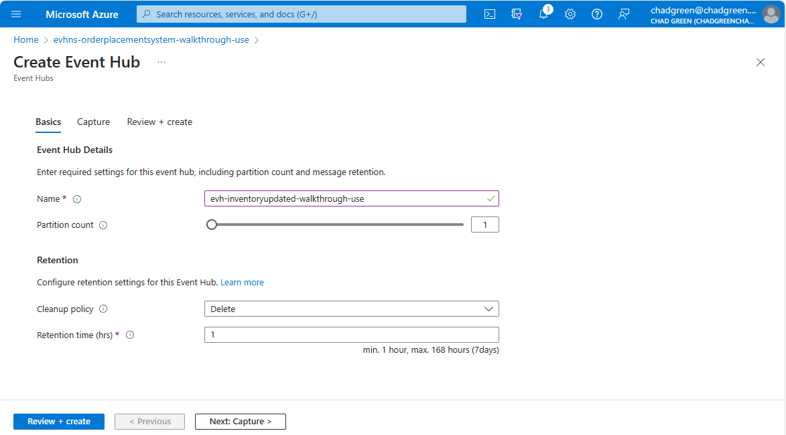
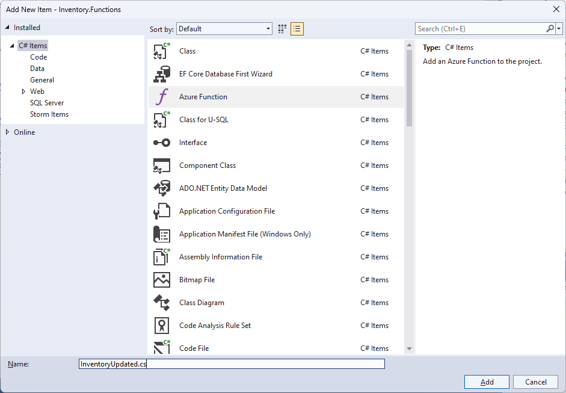

# 09 - Inventory Updated Notice

## User Story
When there is an update to the the inventory of a product, the Inventory system will send out an event message with details of the updated inventory so that subscribed systems can performed needed actions.

## Tasks

### Turn on change tracking on the Inventory database (09A)
1. Execute the **EnableChangeTracking.sql** file from the **Inventory.Database** project on the **Inventory** database.

### Create Inventory Updated Event Hub (09B)
1. From the [Azure Portal](https://portal.azure.com), navigate to the Event Hub namespace you created for the workshop.
1. Click the **+ Event Hub** button.
1. Enter the following information:

| Field                | Value                                       |
|----------------------|---------------------------------------------|
| Name                 | The name of the Inventory Updated event hub |
| Partition count      | 1                                           |
| Cleanup policy       | Delete                                      |
| Retention time (hrs) | 1                                           |

4. Click the **Review + create** button
1. Click the **Create** button

### Add a shared access policy for Inventory to access the Inventory Updated event hub (09C)
1. From the **Event Hubs** listing, click on the event hub you just created
1. Click on the **Shared access policies** option under **Settings** from the left-hand navigation pane
1. Click the **Add** button
1. In the **Add SAS Policy** blade, enter the following:

| Field       | Value     |
|-------------|-----------|
| Policy name | Inventory |
| Manage      | Unchecked |
| Send        | Check     |
| Listen      | Unchecked |

4. Click the **Create** button

**Copy the SAS Policy Connection String**
1. Click on the policy you just created
1. Copy the **Connection string-primary key**

**Add the connection string to Key Vault**
1. Navigate to the Key Vault you created for the workshop
1. Click on the **Secrets** option in the left-hand menu
1. Click the **+ Generate/Import** button
1. Enter the following information

| Field        | Value                               |
|--------------|-------------------------------------|
| Name         | EventHub-InventoryUpdated-Inventory |
| Secret value | The copied key                      | 

5. Click the **Create** button

**Add the Key Vault reference to Azure App Config**
1. Navigate to the GitHub repository you created for the workshop
1. Edit the **OrderProcessingSystem/config/secretreferences.json** file
1. Add the Inventory:EventHubs:InventoryUpdated:ConnectionString element

~~~
"Inventory": {
  "EventHubs": {
    "InventoryReserved": {
      "ConnectionString": "{\"uri\":\"https://{KEYVAULT-ENDPOINT-URL}/secrets/EventHub-InventoryReserved-Inventory\"}"
    },
    "InventoryUpdated": {
      "ConnectionString": "{\"uri\":\"https://{KEYVAULT-ENDPOINT-URL}/secrets/EventHub-InventoryUpdated-Inventory\"}"
    }
  }
}
~~~

4. Click the **Commit changes...** button
1. Verify that the AppConfig GitHub Action completed successfully

### Add service logic for user story (09C)
1. From Visual Studio, open the **InventoryServices.cs** file.
1. Add the **GetInventoryStatusAsync** method to the InventoryServices class.

~~~
public async Task<InventoryUpdatedMessage?> GetInventoryStatusAsync(string productId)
{
	using InventoryContext inventoryContext = new(_configServices);
	return await GetInventoryStatusAsync(productId, inventoryContext);
}
~~~

3. Add the **InventoryUpdatedAsync** method to the InventoryServices class.

~~~
public async Task InventoryUpdatedAsync(string productId)
{
	InventoryUpdatedMessage? inventoryUpdatedMessage = await GetInventoryStatusAsync(productId);
	if (inventoryUpdatedMessage is not null)
		await SendMessageToEventHubAsync(
			_configServices.InventoryEventHubsInventoryUpdatedConnectionString,
			_configServices.InventoryEventHubsInventoryUpdatedEventHubName,
			JsonSerializer.Serialize(inventoryUpdatedMessage));
}
~~~

### Create an Azure Function to watch for changes to the Inventory.InventoryTransaction table (9D)
1. From Visual Studio, right-click on the **Functions** folder within the **Inventory.Functions** folder and click the **Add > New Azure Function**
1. Enter **InventoryUpdated.cs** for the name of the new Azure Function class.

3. Click the **Add** button
1. Select the **SQL trigger** and specify the following values:

| Field                          | Value                              |
|--------------------------------|------------------------------------|
| Connection string setting name | SqlConnectionString                |
| Event Hub name                 | [Inventory].[InventoryTransaction] |

5. Click the **Add** button.
1. Replace the auto-generated code with the following:

~~~
using BuildingBricks.Inventory;
using BuildingBricks.Inventory.Models;
using Microsoft.Azure.Functions.Worker;
using Microsoft.Azure.Functions.Worker.Extensions.Sql;
using Microsoft.Extensions.Logging;

namespace Inventory.Functions;

public class InventoryUpdated
{

	private readonly ILogger _logger;
	private readonly InventoryServices _inventoryServices;

	public InventoryUpdated(ILoggerFactory loggerFactory, InventoryServices inventoryServices)
	{
		_logger = loggerFactory.CreateLogger<InventoryUpdated>();
		_inventoryServices = inventoryServices;
	}

	[Function("InventoryUpdated")]
	public async Task RunAsync(
			[SqlTrigger("[Inventory].[InventoryTransaction]", "SqlConnectionString")] IReadOnlyList<SqlChange<InventoryTransaction>> changes,
			FunctionContext context)
	{
		foreach (SqlChange<InventoryTransaction> change in changes)
		{
			_logger.LogInformation("InventoryUpdated: {ProductId}", change.Item.ProductId);
			await _inventoryServices.InventoryUpdatedAsync(change.Item.ProductId);
		}
	}

}
~~~

7. Open the **local.settings.json** file within the **Purchase.Functions** project.
1. Add the InventoryReservedConnectionString, InventoryReservedEventHub, and InventoryReservedConsumerGroup values.

~~~
{
  "IsEncrypted": false,
  "Values": {
    "AzureWebJobsStorage": "UseDevelopmentStorage=true",
    "FUNCTIONS_WORKER_RUNTIME": "dotnet-isolated",
    "AppConfigEndpoint": "{APP-CONFIG-ENDPOINT}",
    "ServiceBusConnectionString": "{SERVICE_BUS_CONNECTION_STRING}",
    "OrderPlacedQueue": "{ORDER_PLACED_QUEUE_NAME}",
    "SqlConnectionString": "{INVENTORY_DATABASE_CONNECTION_STRING}"
  }
}
~~~

### Inventory Updated Notice (09E)
1. Open Postman and create a new request
1. Change the HTTP verb to **Post**
1. Paste the **PlaceOrder** endpoint URL
1. Click the **Body** tab
1. Select **raw** and **JSON**
1. Enter the JSON below:

~~~
{
  "customerId": 1,
  "items":
  [
    {
      "productId": "10255",
      "quantity": 1
    }
  ]
}
~~~

7. Click the **Send** button
8. Validate that the appropriate Purchase.CustomerPurchase and Purchase.PurchaseLineItem record was updated