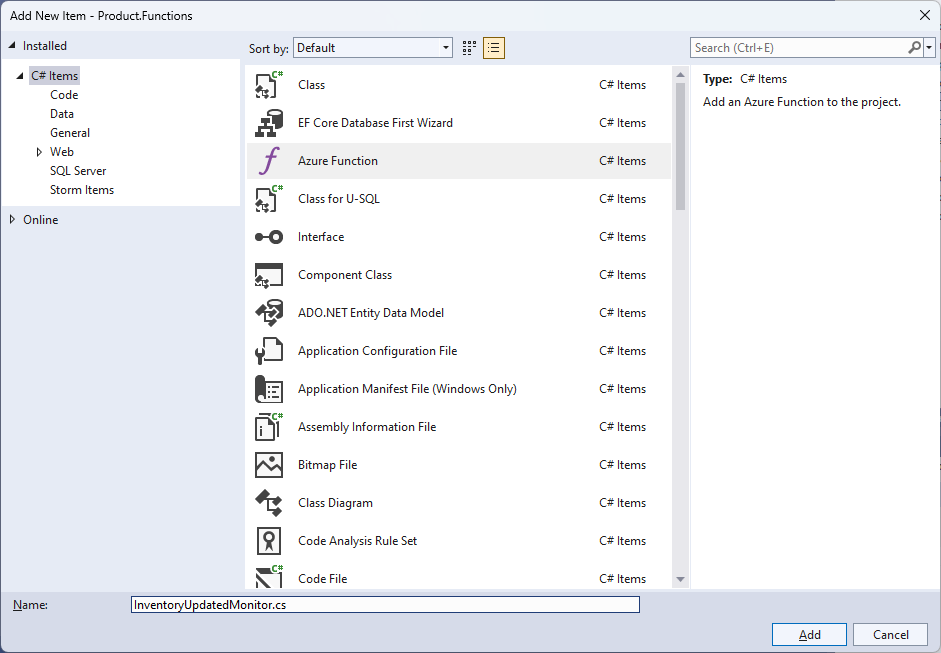
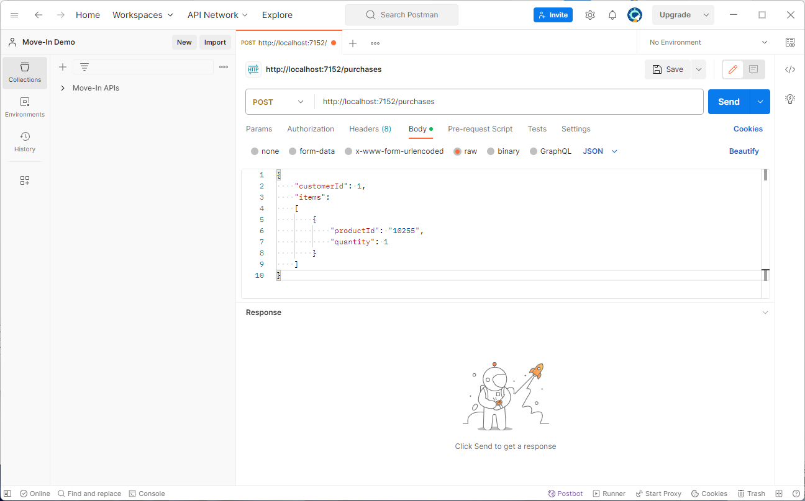

# 11 - Product Availability Update

## User Story
When the Product service receives an Inventory Updated event message, the affected product availability will be updated.  The updated product availability will be based upon the following:

| Inventory Level               | Product Availability   |
|-------------------------------|------------------------|
| More than 0                   | Available Now          |
| Less than 1 but more than -10 | Backordered            |
| Less than -10                 | Temporary Out of Stock |

## Tasks
- 11A - [Add consumer group for Product on the Inventory Updated Event Hub](#add-consumer-group-for-product-on-the-invnetory-updated-event-hub-11a)
- 11B - [Add a shared access policy for Purchase to access the Inventory Reserved event hub](#add-a-shared-access-policy-for-purchase-to-access-th-inventory-reserved-event-hub-11b)
- 11C - [Create an Azure Function to watch for inventory updated notices](#create-an-azure-function-to-watch-for-inventory-updated-notices-11c)
- 11D - [Test the Product Availability Update User Story](#test-the-product-availability-update-user-story-11d)

### Add consumer group for Product on the Inventory Updated Event Hub (11A)
1. From the [Azure Portal](https://azure.portal.com), navigate to the Event Hub namespace created from the workshop.
1. Click on the **Inventory Updated** event hub from the **Event Hubs** listing.
1. Click on the **Consumer groups** option under **Entities** on the left-hand navigation panel
1. Click the **+ Consumer group** button.
1. Enter *product* in the **Name** field.
1. Click the **Create** button.

### Add a shared access policy for Purchase to access the Inventory Reserved event hub (11B)
1. Click on the **Shared access policies** option under **Settings** on the left-hand navigation panel.
1. Click the **+ Add** button
1. In the **Add SAS Policy** blade, provide the enter the following:

- **Policy name**: Product
- **Manage**: Unchecked
- **Send**: Unchecked
- **Listen**: Checked

7. Click the **Create** button
1. Click on the policy you just created
1. Copy the **Connection string-primary key**

### Create an Azure Function to watch for inventory updated notices (11C)
1. From Visual Studio, right-click on the **Functions** folder within the **Notice.Functions** folder and click the **Add > New Azure Function**
1. Enter **InventoryUpdatedMonitor.cs** for the name of the new Azure Function class.

3. Click the **Add** button
1. Select the **Event Hub trigger** and specify the following values:

| Field                          | Value                             |
|--------------------------------|-----------------------------------|
| Connection string setting name | InventoryUpdatedConnectionString |
| Event Hub name                 | %InventorUpdatedEventHub%        |

5. Click the **Add** button.
1. Replace the auto-generated code with the following:

~~~
using Azure.Messaging.EventHubs;
using BuildingBricks.Core.EventMessages;
using BuildingBricks.Product.Models;
using BuildingBricks.Product.Services;
using Microsoft.Azure.Functions.Worker;
using Microsoft.Extensions.Logging;
using System.Text.Json;

namespace BuildingBricks.Product.Functions;

public class InventoryUpdatedMonitor
{

	private readonly ILogger<InventoryUpdatedMonitor> _logger;
	private readonly MerchandiseServices _merchandiseServices;
	private readonly AvailabilityServices _availabilityServices;

	private const int _availableNow = 1;
	private const int _backordered = 2;
	private const int _comingSoon = 3;
	private const int _outOfStock = 4;

	public InventoryUpdatedMonitor(
		ILogger<InventoryUpdatedMonitor> logger,
		MerchandiseServices merchandiseServices,
		AvailabilityServices availabilityServices)
	{
		_logger = logger;
		_merchandiseServices = merchandiseServices;
		_availabilityServices = availabilityServices;
	}

	[Function(nameof(InventoryUpdatedMonitor))]
	public async Task Run([EventHubTrigger("%InventoryUpdatedEventHub%", Connection = "InventoryUpdatedConnectionString", ConsumerGroup = "%InventoryUpdatedConsumerGroup%")] EventData[] eventMessages)
	{
		foreach (EventData eventMessage in eventMessages)
		{
			InventoryUpdatedMessage? inventoryUpdatedMessage = JsonSerializer.Deserialize<InventoryUpdatedMessage>(eventMessage.EventBody);
			if (inventoryUpdatedMessage is not null)
			{
				_logger.LogInformation("Inventory Updated - ProductId: {ProductId} - Available: {Availability}", inventoryUpdatedMessage.ProductId, inventoryUpdatedMessage.InventoryAvailable);
				List<Availability> availabilities = await _availabilityServices.GetListAsync();
				Merchandise merchandise = await _merchandiseServices.GetAsync(inventoryUpdatedMessage.ProductId);
				if (inventoryUpdatedMessage.InventoryAvailable > 0)
				{
					Availability? availableNow = availabilities.FirstOrDefault(x => x.LegacyId == _availableNow);
					if (availableNow is not null && merchandise.AvailabilityId != availableNow.Id)
					{
						_logger.LogWarning("{ProductId} is now available", inventoryUpdatedMessage.ProductId);
						await UpdateMerchandiseAvailability(merchandise, availableNow);
					}
				}
				else if (inventoryUpdatedMessage.InventoryAvailable >= -10)
				{
					Availability? backordered = availabilities.FirstOrDefault(x => x.LegacyId == _backordered);
					if (backordered is not null && merchandise.AvailabilityId != backordered.Id)
					{
						_logger.LogWarning("{ProductId} is now backordered", inventoryUpdatedMessage.ProductId);
						await UpdateMerchandiseAvailability(merchandise, backordered);
					}
				}
				else if (inventoryUpdatedMessage.InventoryAvailable < -10)
				{
					Availability? outOfStock = availabilities.FirstOrDefault(x => x.LegacyId == _outOfStock);
					if (outOfStock is not null && merchandise.AvailabilityId != outOfStock.Id)
					{
						_logger.LogWarning("{ProductId} is now out of stock", inventoryUpdatedMessage.ProductId);
						await UpdateMerchandiseAvailability(merchandise, outOfStock);
					}
				}
				else
				{
					_logger.LogWarning("{ProductId} has no change in availability status", inventoryUpdatedMessage.ProductId);
				}
			}
		}
	}

	private async Task UpdateMerchandiseAvailability(Merchandise merchandise, Availability availability)
	{
		merchandise.AvailabilityId = availability.Id;
		merchandise.Availability = availability.Name;
		await _merchandiseServices.ReplaceAsync(merchandise);
	}

}
~~~

7. Open the **local.settings.json** file within the **Purchase.Functions** project.
1. Add the InventoryReservedConnectionString, InventoryReservedEventHub, and InventoryReservedConsumerGroup values.

~~~
{
  "IsEncrypted": false,
  "Values": {
    "AzureWebJobsStorage": "UseDevelopmentStorage=true",
    "FUNCTIONS_WORKER_RUNTIME": "dotnet-isolated",
    "AppConfigEndpoint": "{APP_CONFIG_ENDPOINT}",
    "ConnectionString": "{COSMOS_CONNECTION_STRING}",
    "InventoryUpdatedConnectionString": "{INVENTORY_UPDATED_EVENT_HUB_CONNECTION_STRING}",
    "InventoryUpdatedEventHub": "{INVENTORY_UPDATED_EVENT_HUB_NAME}",
    "InventoryUpdatedConsumerGroup": "{INVNETORY_UPDATED_EVENT_HUB_CONSUMER_GROUP}"
  }
}
~~~

### Test the Product Availability Update User Story (11D)
1. Open Postman and create a new request
1. Change the HTTP verb to **Post**
1. Paste the **PlaceOrder** endpoint URL
1. Click the **Body** tab
1. Select **raw** and **JSON**
1. Enter the JSON below:

~~~
{
  "customerId": 1,
  "items":
  [
    {
      "productId": "10295",
      "quantity": 1
    }
  ]
}
~~~

7. Click the **Send** button
8. Validate that the appropriate Purchase.CustomerPurchase and Purchase.PurchaseLineItem record was updated