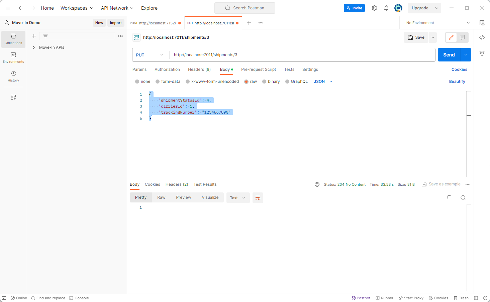

# 13 - Order Fulfillment

## User Story
Once an order is shipped, the Shipping system will send out an OrderShippedMessage message.

## Tasks
-13A - [Create the Order Shipped event hub](#create-the-order-shipped-event-hub-13a)
-13B - [Create the Shipping shared access policy](#create-the-shipping-shared-access-policy-13b)
-13C - [Add the event hub connection string to Key Vault](#add-the-event-hub-connection-string-to-key-vault-13c)
-13D - [Add service logic for user story](#add-service-logic-for-user-story-13d)
-13E - [Test the Product Availability Update User Story](#test-the-product-availability-update-user-story-13e)

### Create the Order Shipped event hub (13A)
1. From the [Azure Portal](https://azure.portal.com), navigate to the Event Hub namespace created for the workshop.
1. Click the **+ Event Hub** button.
1. Enter the following information:

| Field                | Value                  |
|----------------------|------------------------|
| Name                 | Name for the event hub |
| Partition count      | 1                      |
| Cleanup policy       | Delete                 |
| Retention time (hrs) | 1                      |

4. Click the **Review + create** button.
5. Click the **Create** button.

### Create the Shipping shared access policy (13B)
1. From the **Event Hubs** listing, click on the event hub you just created.
1. Click the **Shared access policies** under the **Settings** on the left-hand navigation pane.
1. Click the **+ Add** button.
1. Enter the following values:

| Field       | Value     |
|-------------|-----------|
| Policy name | Shipping  |
| Manage      | Unchecked |
| Send        | Checked   |
| Listen      | Unchecked |

5. Click the **Create** button.

### Add the event hub connection string to Key Vault (13C)
1. From the [Azure Portal](https://azure.portal.com), navigate to the Key Vault created for the workshop.
1. Click the **Secrets** option under the **Objects** on the left-side navigation pane.
1. Click the **+ Generate/Import** button.
1. Enter the following values:

| Field        | Value                                       |
|--------------|---------------------------------------------|
| Name         | EventHub-OrderShipped-Shipping              |
| Secret value | Connection string copied from previous step |

5. Click the **Create** button.
1. From the GitHub repository you created for the workshop, open the **config/secretreferences.json** in edit mode.
1. Add the **Shipping:EventHubs:OrderShipped:ConnectionString** element:

~~~
"Shipping": {
  "EventHubs": {
    "OrderShipped": {
      "ConnectionString": "{\"uri\":\"https://kv-opswalkthough.vault.azure.net/secrets/EventHub-OrderShipped-Shipping\"}"
    }
  }
}
~~~

8. Click the **Commit changes...** button.
1. Validate that the **AppConfig** workflow completes successfully.

### Add service logic for user story (13D)
1. From Visual Studio, open the **ShippingServices.cs** file.
1. Add the **SendEventMessageIfNecessaryAsync** method to the ShippingServices class.

~~~
private async Task SendEventMessageIfNecessaryAsync(Shipment shipment)
{
	if (shipment.ShipmentStatusId == ShipmentStatuses.Shipped)
	{
		OrderShippedMessage orderShippedMessage = new()
		{
			OrderId = shipment.CustomerPurchaseId,
			Carrier = shipment.ShippingCarrier.ShippingCarrierName,
			TrackingNumber = shipment.TrackingNumber
		};
		await SendMessageToEventHubAsync(_configServices.ShippingOrderShippedEventHubConnectionString, JsonSerializer.Serialize(orderShippedMessage));
	}
}
~~~

3. Update the **UpdateShipmentStatusAsync** method to call the **SendEventMessageIfNecessaryAsync** method.

~~~
public async Task UpdateShipmentStatusAsync(
	int shipmentId,
	UpdateShipmentStatusRequest updateShipmentStatusRequest)
{

	using ShippingContext shippingContext = new(_configServices);

	// Retrieve the shipment to be updated
	Shipment? shipment = await shippingContext.Shipments
		.Include(x => x.CustomerPurchase)
		.FirstOrDefaultAsync(x => x.ShipmentId == shipmentId)
		?? throw new ArgumentNullException(nameof(shipmentId));

	// Validate the specified shipment status
	ShipmentStatus? shipmentStatus = await shippingContext.ShipmentStatuses.FirstOrDefaultAsync(x => x.ShipmentStatusId == updateShipmentStatusRequest.ShipmentStatusId)
		?? throw new ArgumentOutOfRangeException(nameof(updateShipmentStatusRequest), "Invalid shipping status specified.");

	// Validate the specified shipping carrier
	ShippingCarrier? carrier = null;
	if (updateShipmentStatusRequest.CarrierId is not null)
	{
		carrier = await shippingContext.ShippingCarriers.FirstOrDefaultAsync(x => x.ShippingCarrierId == updateShipmentStatusRequest.CarrierId)
			?? throw new ArgumentOutOfRangeException(nameof(updateShipmentStatusRequest), "Invalid shipping carrier specified.");
	}

	// Update the shipment record
	shipment.ShipmentStatusId = shipmentStatus.ShipmentStatusId;
	shipment.ShippingCarrierId = carrier?.ShippingCarrierId ?? null;
	shipment.TrackingNumber = updateShipmentStatusRequest.TrackingNumber;
	await shippingContext.SaveChangesAsync();

	// Send event message if necessary
	await SendEventMessageIfNecessaryAsync(shipment);

}
~~~

### Test the Product Availability Update User Story (13E)
1. Open Postman and create a new request
1. Change the HTTP verb to **Post**
1. Paste the **UpdateShippingStatus** endpoint URL
1. Click the **Body** tab
1. Select **raw** and **JSON**
1. Enter the JSON below:

~~~
{
  "shipmentStatusId": 4,
  "carrierId": 1,
  "trackingNumber": "1234567890"
}
~~~

7. Click the **Send** button